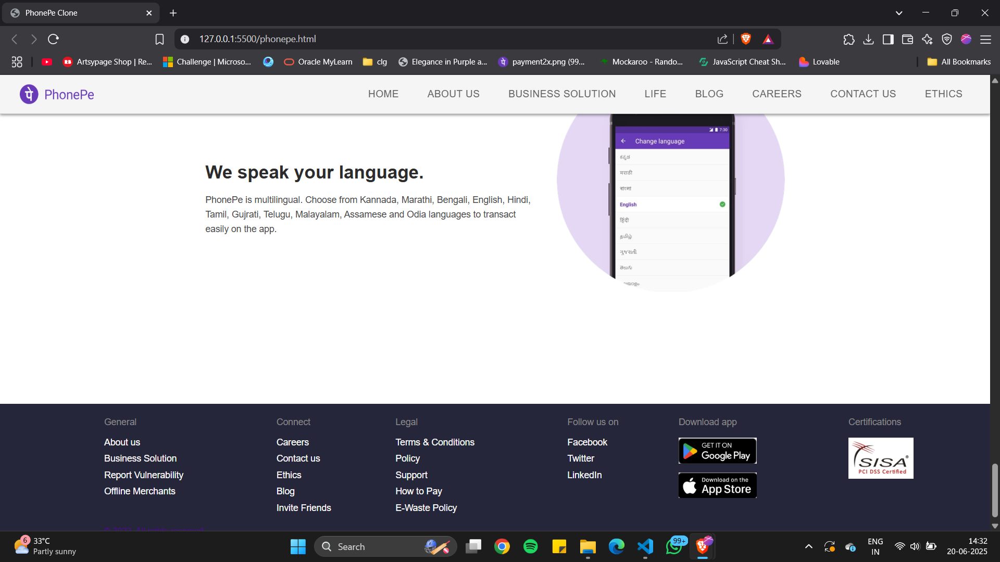

🚀 PhonePe Landing Page Clone

This project is a **static clone** of the official **PhonePe** landing page, built purely with **HTML** and **CSS**. It’s a **frontend challenge** to recreate a modern, responsive UI with clean code and design accuracy.

🌟 Features

* Responsive design adapting to various screen sizes
* Clean, modular CSS structure for easy maintenance
* Accurate layout with flexbox and grid
* Hover effects for interactive elements
* Pixel-perfect clone of the original design

🎨 Technologies Used

* HTML5
* CSS3 (Flexbox, Grid, Media Queries)
* No JavaScript

📸 Screenshots

| Desktop View                                      |                                      
| ------------------------------------------------- | 
|  | 

🚀 How to Run

1. Clone the repository:
2. 
   git clone https://github.com/your-username/phonepe-landing-page-clone.git
 
3. Open `index.html` in your browser.
4. Explore the design, play with it, or customize it further!

💡 What I Learned

* Building responsive layouts from scratch
* Mastery over CSS Flexbox and Grid systems
* Attention to design details and typography
* Understanding modern landing page structures

🤝 Let’s Connect

* [LinkedIn](https://www.linkedin.com/in/shravya-pendota-451678282/)
* [GitHub](https://github.com/shravyapendota)
* [Credly](https://www.credly.com/users/shravya-pendota/)

📢 Disclaimer

This project is a **frontend practice clone** for learning purposes only. It’s **not affiliated with PhonePe** or intended for commercial use.

